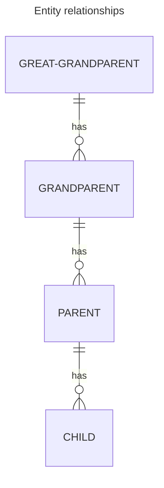

## Backstory

The application I'm primarily working on at work at the moment is
a fairly typical web app. The primary page that users start on is
a large table of data related to things that they need to work on.
We started getting actual users towards the end of last year, and
while the user set was initially small, the actual data set we were
working with was quite large. This is because we were migrating
users over from a legacy web app onto our new one, and we needed
relevant data for all users, so that as they onboard they could
immediately use our new app.

Generally this worked pretty well. However, we started noticing that
occassionally, instead of getting a response in less than 5 seconds
(typically less than one), there was sometimes wait times of up to
a minute. This obviously lead to a bad user experience and was
something that we wanted to solve, so my team started looking into
what the root cause might be. Interestingly, it did not seem to be
predictable based on the amount of data the user was working with -
our first customer had a lot of data and was consistently getting
fast responses, while others with much smaller data sets were sometimes
waiting 45 seconds instead of <1 second.

## The Investigation Begins

Here is what the data looked like at a high level; there were four
layers of data specificity:

When investigating performance issues in queries, my mind always
jumps to indexes. As such I began by insuring that all of the columns
used in the joins and `WHERE` clause had appropriate indexes on them -
which they did. Complicating my investigation was the fact that the table
we were querying was actually a partitioned table - we'll call those
partitions "new" and "legacy." Despite that, all of the data we were
querying actually only existed in the "legacy" tables - and we were
specifying that in how we filtered the results. The Postgres `EXPLAIN`
tool helped to confirm that as well - it's very helpful that it shows
the actual entities being queried!
