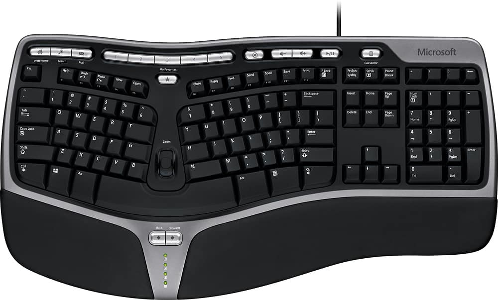

## Introduction

Last year - in November - I took the leap into the world of split keyboards. I
had been interested in them for a long time, but was quite happy with my [HHKB
Layout](https://hhkb.io/layout/), and was trying to avoid spending more money.
But, after joining a company that did frequent offsites, I was having to choose
between lugging around an aluminum keyboard (Tofu v1 HHKB for those interested)
that weighed about 5 pounds and didn't fit properly in my backpack, or using
the built-in keyboard on my MacBook.

With this in mind, when I heard a [Changelog
episode](https://changelog.com/podcast/608) with the creator of the
[Voyager](https://www.zsa.io/voyager), I couldn't get the idea of switching out
of my head. After having the page open in my browser for about a month I
finally pulled the trigger. I ended up ordering the keyboard itself plus the
tripod mount, which I wasn't sure I needed yet - but I wanted to avoid paying
for shipping twice.

## Colemak Layout

While I waited for my delivery, I ended up reprogramming a keyboard I already
had (yes, I have too many) to the [Colemak DH
layout](https://colemakmods.github.io/mod-dh/). I did this largely due to the
advice from Erez on the Changelog episode, right at the beginning, which was to
switch layouts before even buying anything. There are folks much more
knowledgeable than me on this topic, but the basic gist is that the typical
QWERTY layout found on most keyboards dates back to typewriters and is
extremely inefficient. The philosophy behind Colemak is to put the keys you use
the most closest to the homerow, so that your fingers don't have to move as
much. In addition to that, characters that are frequently used next each other
in words are intentionally placed on different fingers so that the same finger
doesn't need to type two characters in a row as often. Finally, Colemak tries
to do this while keeping as many keys in the same place as QWERTY to make it
easier to switch. All in all, 17 keys change places between the two layouts.

In all honesty, this was probably a bigger change than switching to a new
keyboard. As someone who has been typing pretty fast for a very long time, I
was worried that my speed would suffer, as well as that I'd forget how to type
on traditional keyboards. My typing speed definitely took a hit at first, but I
did my best to stick with it and utilized some online typing games to try to
help out. The typical suggestion here is to switch one set of characters at a
time... but I totally ignored that sage wisdom and jumped in headfirst. My
typing plummeted from 100-120wpm down to about 20-30, but over the course of
about a week I was back up to about 50, where many people are anyways. I was
already starting to "feel" what the eventual benefits would be which was great
motivation to keep going. Over time, my speed has continued to increase, and
I'm now up to about 100wpm, just below where I was with QWERTY.

Before I forget - the "Mod DH" part of my layout is a minor change to
traditional Colemak. It moves a couple of the keys around to create a layout
that is even more efficient than the original Colemak one. The details aren't
that important, and either option is a big improvement over QWERTY.

## Why the Voyager

Along with the layout changes, I have been thinking of switching (no pun
intended) to a split keyboard for many years. Before I got into mechanical
keyboards, I was using a Microsoft Natural Ergonomic keyboard that was provided
to me at work after I had some wrist pain from writing code all day. While the
layout can be frustrating for some - especially if you don't use the "correct"
hand for all of your keys - I actually quite enjoyed having my wrists at a
slant. After that, I became interested in splits when there were very few of
them - the Ergodox and Kinesis Advantage being the main choice at that time.
One of my friends actually got one back then, which I got to try, but found
that it had a few more keys than I would prefer, making me move my fingers more
than on my HHKB. Since that time, split boards have become much more popular -
there are new options from existing companies, as well as totally new entrants.
Keyboards like the Kinesis Advantage360, the Glove80, the Moonlander, and more
all look like great options. On top of that, there are now a bunch of kits,
like the Iris and Corne - options to fit anyone's preferences.

So, why did I pick the Voyager specifically as my split keyboard? It probably
helped to hear the CEO of the company on a podcast I love, but it also seemed
to have everything I was looking for:

- Durable - made of good materials, and I can repair it myself
- Light and easy to transport
- Compact layout
- Replaceable, standard parts (Choc switches and keycaps)
- Don't need to build it myself (I have done this, but it ends up taking me
forever to find the time)
- Tenting/angle options

Originally I was also intending to have my board be wireless. However, after
listening to Erez on Changelog discuss why their boards _aren't_ wireless, I
found myself nodding along, and decided to stick with a wired board, as I had
already been doing anyways. That narrowed it down even more, and so I landed on the Voyager.

In my opinion, the main downside to it is the price. The Voyager is by no means
a cheap keyboard aimed at those who are not sure of what they want. It is on
the high end, but made of quality parts, and will last decades. With that in
mind, I pulled the trigger. On the topic of tenting options, I have actually
found the magnetic feet that the Voyager comes with provide a slight tent but
one that is comfortable to me, so that is what I use the vast majority of the
time.

One other minor note - I am not a huge fan of the default Choc switches that
are available when purchasing a Voyager. This is mostly because I have used
mechanical switches for a number of years and have gotten a little particular
(most recently, lubed and filmed Gateron ink blacks). This was pretty easy to
fix by ordering some
[Twilight](https://lowprokb.ca/products/ambients-silent-choc-switches)
switches... but, as the Voyager uses Choc v1 switches - which have been going
out of style - I do wonder about being able to purchase extras years from now
(so I stocked up a little bit).

## Switching Between Boards and Layouts

Once I had placed my order, one of my main concerns was how difficult it would
be to switch between my split, columnar-layout keyboard with a "weird" layout
and a traditional keyboard or the one built-in to my laptop, which I still use
from time to time. This was indeed a problem at first - before I felt "fluent"
in Colemak, I would find myself getting confused for a bit when switching
layouts.

However, now that I am comfortable with this board as a whole, it has not been
a big problem. It might help for muscle memory that I only use Colemak with
this specific board, and so my hands know the difference when they are split
and angled - I'm not really sure. But what I do know is that for normal typing
especially, when just typing messages or notes, I don't get tripped up much.
The main exception to this is in Vim - I am a [Vim user](../my-start-in-vim)
and my fingers don't always remember the difference when switching back to a
standard QWERTY layout for my Vim commands. It doesn't take too long to adjust,
but does come up from time to time. I imagine if I were to use Vim on a QWERTY
layout more often, I would adjust more quickly, but most of the time when I'm
coding I want to use my Voyager anyways.

## Conclusion / Retrospective

All in all I am very happy I went down this rabbit hole. It took some research,
muscle training, and money, but I enjoy typing even more than before. I also
find myself taking my Voyager with me more often to coffee shops or even across
the house than I did with my traditional mechanical keyboard, as it is just
easier to transport. If you are looking to do something similar, I highly
recommend this keyboard, but also starting with switching to Colemak using your
current keyboard as Erez suggested. Feel free to reach out if you want to talk
keyboards!
